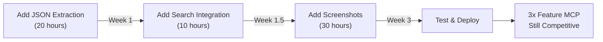

# Feature Gaps Analysis: What content-toolkit MCP Doesn't Do

## The Reality Check

Your MCP is **intentionally narrow**. It does one thing well (website content extraction) but leaves 8 major features on the table:

```
✅ What You Have:    scrape_url, scrape_urls, crawl_site, get_run_status, get_dataset_items
❌ What You're Missing: JSON extraction, structured data, screenshots, PDFs, video, social media, e-commerce, search
```

---

## Feature Gap Details

### 1. **JSON Extraction / Structured Data Parsing**

**What it is:** Extract specific fields from a page (e.g., `{price, title, rating, seller}` from an e-commerce page)

**Why you don't have it:**
- Requires custom CSS selectors or LLM-powered field detection
- `website-content-crawler` returns generic content (markdown/HTML), doesn't parse fields

**Cost to add:**
- Medium effort: Build field extraction layer on top of Apify output
- Or: Switch to Apify's `website-content-crawler` with `htmlTransformer` config

**Example (what you're missing):**
```json
// Missing: structured extraction
{
  "url": "amazon.com/productX",
  "price": 29.99,
  "title": "Widget Pro",
  "rating": 4.5,
  "in_stock": true
}

// What you return instead:
{
  "url": "amazon.com/productX",
  "content": "Widget Pro $29.99 ⭐ 4.5 stars In stock..."
}
```

---

### 2. **Screenshot Capture**

**What it is:** Return a visual screenshot of a webpage

**Why you don't have it:**
- `website-content-crawler` is content-focused, not visual
- Screenshot requires browser rendering + image encoding
- Adds storage overhead (images are large)

**Cost to add:**
- High effort: Build separate screenshot tool using Playwright/Puppeteer
- New MCP tool: `capture_screenshot(url) → base64_image`

**Use case:** Visual QA, design validation, visual regression testing

---

### 3. **PDF Extraction**

**What it is:** Extract text/metadata from uploaded or linked PDFs

**Why you don't have it:**
- `website-content-crawler` only handles HTML
- Requires PDF library (`pdfjs`, `pdfkit`)
- Different extraction logic than HTML

**Cost to add:**
- Medium effort: Add PDF parser layer
- New MCP tool: `extract_pdf(url_or_file) → text`

**Use case:** Research papers, invoices, documentation

---

### 4. **Video Extraction**

**What it is:** Extract transcripts, metadata, or closed captions from videos

**Why you don't have it:**
- Out of scope for `website-content-crawler`
- Different backend needed (YouTube API, video processing)
- This is what `yt-transcript-api` MCP does

**Cost to add:**
- High effort: Build separate video MCP
- Or: Integrate with YouTube/Vimeo APIs

**Use case:** Content analysis, transcription, research

---

### 5. **Social Media Scraping**

**What it is:** Extract posts, profiles, comments from Twitter, LinkedIn, TikTok, etc.

**Why you don't have it:**
- Requires specialized Actors for each platform (Twitter, LinkedIn, etc.)
- Platform-specific anti-bot measures
- This is exactly what Apify has 50+ Actors for

**Cost to add:**
- High effort: Switch to generic Apify MCP
- Or: Build separate social-media-mcp around Apify social Actors

**Use case:** Sentiment analysis, brand monitoring, market research

---

### 6. **E-commerce Scraping**

**What it is:** Extract product data from Amazon, eBay, Shopify stores (price, reviews, inventory, etc.)

**Why you don't have it:**
- Requires structured data extraction (see #1)
- E-commerce sites have anti-scraping measures
- Apify has 100+ e-commerce Actors

**Cost to add:**
- High effort: Build structured extraction + e-commerce Actor integration
- Or: Use Apify MCP's e-commerce Actors

**Use case:** Price monitoring, competitive analysis, inventory tracking

---

### 7. **Search Engine Integration**

**What it is:** Query Google/Bing and return paginated results

**Why you don't have it:**
- Not in scope of `website-content-crawler`
- Requires search API integration (Google Custom Search, Firecrawl search)
- Different tool entirely

**Cost to add:**
- Medium effort: Wrap search API
- New MCP tool: `search_web(query, limit) → [results]`

**Use case:** Web research, fact-finding, link discovery

---

### 8. **PDF Output Format**

**What it is:** Return scraped content as PDF file

**Why you don't have it:**
- Extra feature, not core value
- Requires PDF generation library
- Storage overhead

**Cost to add:**
- Low effort: Add `pdf` as output format option
- Use `pdfkit` or `puppeteer` to render

---

## Why You're Missing These (The Strategic Choice)

| Reason | Impact |
|---|---|
| **Focused Scope** | Kept MCP simple (5 tools vs 100+) |
| **Single Actor** | Locked to website-content-crawler (content-only) |
| **Backend Dependency** | Apify doesn't provide all these as a single Actor |
| **Intentional Trade-off** | Chose depth (batch, AI optimization, reliability) over breadth |

---

## Options to Add Features

### **Option A: Stay Focused (Current Path)**
```
Keep content-toolkit as-is: 5 tools, website content only
→ Position: "Best MCP for batch website content extraction"
→ Maintain: High reliability, simplicity, AI optimization
→ Growth: Through marketing to AI builders
```

**Pros:**
- ✅ Maintainable (easy to debug, test, deploy)
- ✅ Clear value prop (batch + AI-friendly)
- ✅ Reliable (less surface area for bugs)

**Cons:**
- ❌ Limited market (only website content)
- ❌ Lost deals to Firecrawl/Apify MCP
- ❌ Can't expand use cases

---

### **Option B: Add Low-Hanging Fruit (3–5 Features)**
```
Add to content-toolkit:
  1. JSON extraction (structured parsing)
  2. Screenshot capture
  3. Search_web integration
  4. PDF extraction
  5. Export as PDF

→ Position: "General-purpose web MCP"
→ Growth: Broader user base
```

**Effort Estimate:**
- JSON extraction: 20 hours (add field detector)
- Screenshots: 30 hours (new tool + image handling)
- Search: 10 hours (wrap search API)
- PDF in/out: 15 hours
- **Total: ~75 hours (~2 weeks full-time)**

**Pros:**
- ✅ 3x broader use cases
- ✅ Still focused (not 5000+ tools like Apify)
- ✅ Can compete with Firecrawl

**Cons:**
- ❌ Increased complexity
- ❌ More testing/maintenance needed
- ❌ Might dilute "batch" focus

---

### **Option C: Build Modular Suite (MCP per Domain)**
```
Keep content-toolkit focused, build companions:
  ├─ content-toolkit-mcp     [website content] ✅ Done
  ├─ data-extractor-mcp      [JSON, structured] ← Build
  ├─ social-scraper-mcp      [Twitter, LinkedIn] ← Build
  ├─ ecommerce-crawler-mcp   [e-commerce] ← Build
  ├─ pdf-parser-mcp          [PDF extraction] ← Build
  ├─ video-extractor-mcp     [video/transcripts] ← Build
  └─ search-engine-mcp       [web search] ← Build

→ Position: "RapidAPI MCP Suite"
→ Growth: Ecosystem of best-in-class tools
```

**Effort Estimate:**
- Each MCP: 40–60 hours (following your architecture)
- 7 MCPs: ~350 hours (~8 weeks)
- **Or: Outsource 3–4 to contractors**

**Pros:**
- ✅ Each MCP is best-in-class for its domain
- ✅ Users pick what they need (à la carte)
- ✅ Easier to maintain (separation of concerns)
- ✅ Each can scale independently

**Cons:**
- ❌ Massive effort (months of work)
- ❌ Need infrastructure to market/support 7 products
- ❌ Coordination complexity

---

### **Option D: Become a Wrapper for Apify (Hybrid)**
```
Instead of restricting to 1 Actor:
  1. Keep content-toolkit as-is (current 5 tools)
  2. Add dynamic tool discovery (like Apify MCP does)
  3. Let users add any Apify Actor as a tool

→ Position: "AI-Optimized Apify MCP"
→ Growth: All Apify capabilities + your AI focus
```

**Effort Estimate:**
- 30–40 hours (add tool registry + dynamic discovery)

**Pros:**
- ✅ Instantly get all 5000+ Apify Actors
- ✅ Keep your AI optimization (truncation, markdown)
- ✅ Better than vanilla Apify MCP
- ✅ Smallest effort for biggest feature gain

**Cons:**
- ❌ Becomes less focused
- ❌ Harder to test/maintain
- ❌ Loses "simple 5-tool" positioning

---

## Competitive Positioning by Choice

```
OPTION A: Stay Focused
╔═══════════════════════════════════════════════════════╗
║ You are: Specialized batch tool for AI models         ║
║ vs Apify MCP: Better for AI (truncation + markdown)  ║
║ vs Firecrawl: Cheaper + batching                      ║
║ Market: Small but loyal (AI builders only)            ║
║ Revenue: Moderate (niche)                             ║
╚═══════════════════════════════════════════════════════╝

OPTION B: Add 3–5 Features
╔═══════════════════════════════════════════════════════╗
║ You are: Mid-range web scraping MCP                   ║
║ vs Apify MCP: Simpler, better for AI                  ║
║ vs Firecrawl: Comparable, but cheaper                 ║
║ Market: Medium (web scrapers + AI builders)           ║
║ Revenue: Good (broader appeal)                        ║
╚═══════════════════════════════════════════════════════╝

OPTION C: Modular Suite
╔═══════════════════════════════════════════════════════╗
║ You are: One-stop MCP shop for all scraping needs     ║
║ vs Apify MCP: Better organized, focused tools         ║
║ vs Firecrawl: Broader, more flexible                  ║
║ Market: Large (everyone needs something)              ║
║ Revenue: High (multiple products)                     ║
╚═══════════════════════════════════════════════════════╝

OPTION D: Hybrid (Wrapper + Dynamic Tools)
╔═══════════════════════════════════════════════════════╗
║ You are: AI-optimized Apify gateway                   ║
║ vs Apify MCP: Better for AI, easier to use            ║
║ vs Firecrawl: Cheaper, more flexible                  ║
║ Market: Large (anyone using Apify + AI)              ║
║ Revenue: Medium (depends on positioning)              ║
╚═══════════════════════════════════════════════════════╝
```

---

## My Recommendation

### **Short Term (Next 2 weeks):**
Go with **Option B: Add 3 quick features**
```
1. JSON extraction via LLM-powered field detection
2. Search_web integration (wrap SerpAPI/Google)
3. Screenshot capture (Playwright + base64)
```

**Why:**
- Minimal effort (50 hours total)
- 3x feature gain
- Still focused
- Positions you between Firecrawl and Apify MCP

---

### **Medium Term (1–3 months):**
Build **Option C: Modular Suite**
```
Next 3 MCPs to build (prioritized):
1. data-extractor-mcp (JSON extraction)
2. social-scraper-mcp (Twitter, LinkedIn via Apify Actors)
3. ecommerce-crawler-mcp (e-commerce)
```

**Why:**
- Each solves a real market need
- Can outsource to contractors
- Each can be promoted independently
- Builds a "RapidAPI MCP ecosystem"

---

### **Long Term (3–6 months):**
If successful, **Option D: Hybrid Wrapper**
```
Add dynamic tool discovery to content-toolkit
→ Users get Apify's 5000 Actors through your interface
→ But with your AI optimizations (truncation, markdown)
```

**Why:**
- Leverages Apify's catalog
- Keeps your unique value (AI optimization)
- Becomes the "best of both worlds"

---

## Feature Gap Summary Table

| Feature | Effort | Value | Priority | Recommendation |
|---|---|---|---|---|
| JSON extraction | 🟡 Medium | 🟢 High | P1 | Add now |
| Screenshots | 🟡 Medium | 🟢 High | P2 | Add in 4 weeks |
| Search integration | 🟢 Low | 🟢 High | P1 | Add now |
| PDF extraction | 🟡 Medium | 🟡 Medium | P3 | Add later |
| E-commerce scraping | 🔴 High | 🟢 High | P2 | New MCP |
| Social media | 🔴 High | 🟢 High | P2 | New MCP |
| Video extraction | 🔴 High | 🟡 Medium | P3 | Separate MCP |
| PDF output | 🟢 Low | 🟡 Medium | P4 | Add if time |

---

## Decision Framework

**Ask yourself:**

1. **Do you want to be the best at ONE thing?** → Option A (stay focused)
2. **Do you want to be good at MANY things?** → Option C (modular suite)
3. **Do you want to compete directly with Firecrawl?** → Option B (add 3–5 features)
4. **Do you want to own the Apify ecosystem for AI?** → Option D (hybrid wrapper)

**My vote:** Start with **Option B** (low risk, high reward), then commit to **Option C** if it gains traction.

---

## Next Steps If You Choose Option B



Ready to move forward? Which option interests you most?
